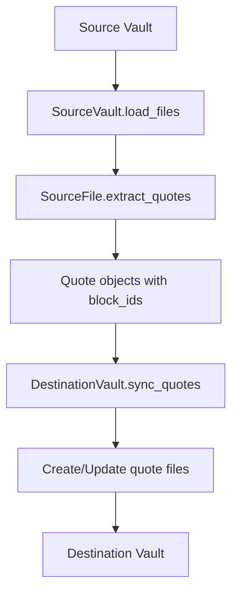
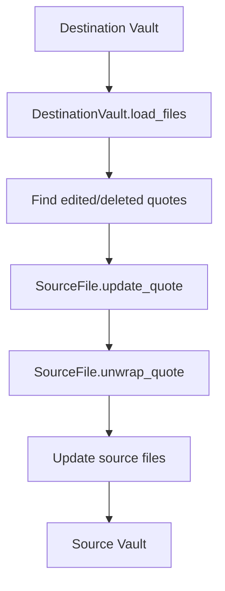

# Architecture

This document describes the technical architecture of the Quote Vault Manager.

## System Overview

The Quote Vault Manager is built around a **vault-based architecture** where source and destination vaults are managed independently but synchronized bidirectionally.

## Module Structure

```
quote_vault_manager/
├── __main__.py              # CLI entry point
├── config.py                # Configuration management
├── file_utils.py            # File system utilities
├── models/                  # Core data models
│   ├── base_vault.py       # Abstract vault base class
│   ├── quote.py            # Quote object definition
│   ├── source_file.py      # Source file operations
│   ├── source_vault.py     # Source vault management
│   ├── destination_file.py # Destination file operations
│   └── destination_vault.py # Destination vault management
├── services/               # Business logic services
│   ├── sync.py            # Main sync orchestration
│   ├── source_sync.py     # Source file sync logic
│   ├── backup_service.py  # Backup operations
│   ├── transformation_manager.py # File transformations
│   └── logger.py          # Logging service
└── transformations/        # File format transformations
    ├── v0_1_add_version.py
    ├── v0_2_add_random_note_link.py
    └── v0_3_add_edited_flag.py
```

## Core Components

### Vault System

The system uses a **vault abstraction** to manage collections of files:

- **`BaseVault`**: Abstract base class defining vault operations
- **`SourceVault`**: Manages source files with sync_quotes flag
- **`DestinationVault`**: Manages quote files with CRUD operations

### File Models

- **`SourceFile`**: Represents a source markdown file with quotes
- **`DestinationFile`**: Represents a single quote file with frontmatter
- **`Quote`**: Core data object representing a quote with state flags

### Services

- **`SyncService`**: Orchestrates the entire sync process
- **`SourceSync`**: Handles source file processing
- **`TransformationManager`**: Manages file format migrations

## Data Flow

### Forward Sync (Source → Destination)



### Reverse Sync (Destination → Source)



## Key Algorithms

### Block ID Assignment

```python
def assign_block_ids(content: str) -> str:
    # Find highest existing block ID
    existing_ids = extract_block_ids(content)
    next_id = max(existing_ids) + 1 if existing_ids else 1
    
    # Assign to quotes without IDs
    for quote in quotes_without_ids:
        quote.block_id = f"^Quote{next_id:03d}"
        quote.needs_block_id_assignment = True
        next_id += 1
```

### Quote Extraction

```python
def extract_quotes(content: str) -> List[Quote]:
    quotes = []
    lines = content.splitlines()
    i = 0
    
    while i < len(lines):
        if is_blockquote_line(lines[i]):
            quote_lines = []
            while i < len(lines) and is_blockquote_line(lines[i]):
                quote_lines.append(lines[i].lstrip('> '))
                i += 1
            
            # Look for block ID
            block_id = None
            if i < len(lines) and is_block_id(lines[i]):
                block_id = lines[i]
                i += 1
            
            quotes.append(Quote('\n'.join(quote_lines), block_id))
        else:
            i += 1
    
    return quotes
```

### File Synchronization

```python
def sync_file(source_file: SourceFile, dest_vault: DestinationVault):
    # Extract quotes from source
    quotes = source_file.extract_quotes()
    
    # Assign missing block IDs
    block_ids_added = source_file.assign_missing_block_ids()
    
    # Sync each quote to destination
    for quote in quotes:
        dest_file = dest_vault.find_or_create_quote_file(quote)
        if dest_file.needs_update:
            dest_file.save()
    
    # Remove orphaned quotes
    orphaned = dest_vault.find_orphaned_quotes(quotes)
    for orphan in orphaned:
        orphan.delete()
```

## State Management

### Quote State Flags

Quotes use flags to track pending operations:

- **`needs_edit`**: Quote text has been modified
- **`needs_unwrap`**: Quote should be unwrapped (removed from blockquote)
- **`needs_block_id_assignment`**: New block ID needs to be written
- **`marked_for_deletion`**: Quote file should be deleted
- **`needs_update`**: Quote file content has changed

### File State Flags

Files track their own state:

- **`is_new`**: File was just created
- **`needs_update`**: File content has changed
- **`marked_for_deletion`**: File should be deleted

## Error Handling

### Strategy

The system uses a **fail-fast with recovery** approach:

1. **Configuration errors**: Exit immediately
2. **File read errors**: Log and skip file
3. **Parse errors**: Log warning and continue
4. **Write errors**: Log error and retry once

### Error Categories

- **Critical**: Configuration, vault access
- **Warning**: Parse errors, duplicate IDs
- **Info**: File operations, sync progress

## Performance Considerations

### File Processing

- **Lazy loading**: Files are only loaded when needed
- **Incremental updates**: Only changed files are processed
- **Batch operations**: Multiple files processed in sequence

### Memory Management

- **Streaming**: Large files are processed line-by-line
- **Object pooling**: Quote objects are reused when possible
- **Garbage collection**: Temporary objects are cleaned up promptly

## Security

### File Operations

- **Path validation**: All paths are validated before use
- **Permission checks**: File permissions are verified
- **Backup creation**: Critical operations create backups

### Data Integrity

- **Dry-run mode**: Safe testing without file changes
- **Atomic operations**: File writes are atomic where possible
- **Validation**: All data is validated before processing

## Extensibility

### Transformation System

The system supports file format migrations through the transformation system:

```python
class Transformation:
    def transform(self, file_content: dict) -> dict:
        # Apply transformation
        return modified_content
```

### Plugin Architecture

Future extensions can be added through:

- **Custom transformations**: New file format versions
- **Additional services**: New sync operations 